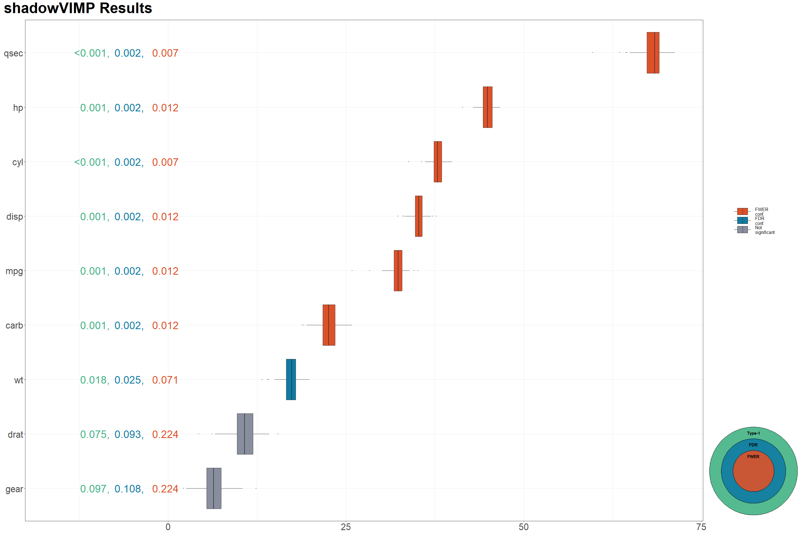

<!-- README.md is generated from README.Rmd. Please edit that file -->

# shadowVIMP

<!-- badges: start -->

[](https://github.com/OktawiaStaburo/shadowVIMP/actions/workflows/R-CMD-check.yaml)
<!-- badges: end -->

<!-- keep`README.md` up-to-date -> use`devtools::build_readme()`-->

## Overview

The goal of `shadowVIMP` is to provide a tool for reducing the number of
covariates considered in an analysis in an informed and statistically
rigorous manner. This package implements a method that performs
statistical tests on the Variable Importance Measures (VIMP) obtained
from the Random Forest (RF) algorithm to determine whether each
covariate is statistically significant and truly informative. In
contrast to widely used methods, such as selecting the top *n*
covariates with the highest VIMP or choosing covariates with a VIMP
above a certain threshold, the method implemented in `shadowVIMP` allows
for a statistical justification of whether a given VIMP is sufficiently
large to be unlikely due to chance. The main function of the package,
`vim_perm_sim_wrapper()`, outputs a table indicating whether each
covariate is informative, along with its associated (adjusted) p-values.
In addition `plot_vimps()` function provides a convenient way to
visualise the VIMPs obtained from the simulation part of the algorithm,
including unadjusted, FDR and FWER adjusted p-values. Details of the
method, a realistic example of its usage, and guidance on interpreting
the results can be found in the vignette:
`vignette("shadowVIMP-vignette")`.

## Installation

New installation required for the GitHub The `shadowVIMP` package is not
(yet!) available on CRAN, but you can install the development version.
Installation instructions:

1.  Create a personal access token (PAT) for yourself. To do this:
    - Login to your GitLab account.
    - Click on your profile photo in the top right corner and select
      “Edit Profile”.
    - Select “Access Tokens” from the menu on the left.
    - Choose a name and expiration date for your token, then save the
      token.
2.  In RStudio, run the following code with your credentials:

``` r
devtools::install_git("https://gitlab.staburo.de/personal/shadowVIMP-package.git",
  credentials = git2r::cred_user_pass("YOUR-GITLAB-USERNAME", "YOUR-PAT-TOKEN")
)
```

Now, after calling `library(shadowVIMP)`, the package should be
available to you.

## Usage

Imagine you are working with a dataset with many variables and you want
to select the subset of the most informative covariates. Instead of
computing the variable importance, displaying it on variable importance
plots, and (somewhat arbitrarily) selecting the set of informative
features, you can use the method implemented in this package and select
the subset of features in a more robust way. The following example shows
the basic use case.

``` r
library(shadowVIMP)
library(magrittr)

data(mtcars)

# For reproducibility
set.seed(789)

# Standard usage - sequential computing
# When working with real data, increase the value of the nsims parameter or leave it at the default value
vimp_seq <- vim_perm_sim_wrapper(entire_data = mtcars, outcome_var = "vs", nsims = c(30, 100, 150))
#> alpha  0.3  
#> 2025-02-13 16:01:43: dataframe = mtcars nsim = 30 num.trees = 10000. Running step 1
#> Variables remaining:  10 
#> alpha  0.1  
#> 2025-02-13 16:01:49: dataframe = mtcars nsim = 100 num.trees = 10000. Running step 1
#> 2025-02-13 16:01:55: dataframe = mtcars nsim = 100 num.trees = 10000. Running step 50
#> 2025-02-13 16:02:02: dataframe = mtcars nsim = 100 num.trees = 10000. Running step 100
#> Variables remaining:  9 
#> alpha  0.05  
#> 2025-02-13 16:02:02: dataframe = mtcars nsim = 150 num.trees = 10000. Running step 1
#> 2025-02-13 16:02:09: dataframe = mtcars nsim = 150 num.trees = 10000. Running step 50
#> 2025-02-13 16:02:15: dataframe = mtcars nsim = 150 num.trees = 10000. Running step 100
#> 2025-02-13 16:02:21: dataframe = mtcars nsim = 150 num.trees = 10000. Running step 150
#> Variables remaining:  7

# Print informative covariates according to the pooled criterion (with and without p-value correction)
vimp_seq$final_dec_pooled
#>   varname quantile_pooled      p_unadj   p_adj_FDR  p_adj_FWER Type1_confirmed
#> 1     cyl       0.9992598 0.0007401925 0.002467308 0.007401925               1
#> 2    qsec       0.9992598 0.0007401925 0.002467308 0.007401925               1
#> 3     mpg       0.9985196 0.0014803849 0.002467308 0.011843079               1
#> 4    disp       0.9985196 0.0014803849 0.002467308 0.011843079               1
#> 5      hp       0.9985196 0.0014803849 0.002467308 0.011843079               1
#> 6    carb       0.9985196 0.0014803849 0.002467308 0.011843079               1
#> 7      wt       0.9822354 0.0177646188 0.025378027 0.071058475               1
#> 8    drat       0.9252406 0.0747594375 0.093449297 0.224278312               0
#> 9    gear       0.9030348 0.0969652110 0.107739123 0.224278312               0
#>   FDR_confirmed FWER_confirmed
#> 1             1              1
#> 2             1              1
#> 3             1              1
#> 4             1              1
#> 5             1              1
#> 6             1              1
#> 7             1              0
#> 8             0              0
#> 9             0              0

# The significance level used for the test in the last step
vimp_seq$alpha
#> [1] 0.05

# Are the displayed results from the last or the previous step?
vimp_seq$result_taken_from_previous_step
#> [1] FALSE

# Check the time needed to execute each step of the algorithm and the entire procedure
vimp_seq$time_elapsed
#> $step_1
#> [1] 0.09540758
#> 
#> $step_2
#> [1] 0.2246519
#> 
#> $step_3
#> [1] 0.3253163
#> 
#> $total_time_mins
#> [1] 0.6453758

# Check the call code that was used to create the inspected object
vimp_seq$call
#> vim_perm_sim_wrapper(nsims = c(30, 100, 150), entire_data = mtcars, 
#>     outcome_var = "vs")

# Check the simulated VIMPs of the covariates and their shadows from the last step of the procedure
vimp_seq$vimp_history %>% head()
#>        mpg      cyl     disp       hp     qsec     carb       wt      drat
#> 1 32.96580 37.83467 34.28494 44.40825 69.39776 24.06262 15.92240  6.592342
#> 2 33.94531 37.67475 33.80626 43.52956 69.47350 22.87792 15.14960 11.407349
#> 3 30.08375 37.37923 35.83397 45.54814 63.48126 21.02905 19.53125  9.903495
#> 4 32.87286 37.27228 33.33198 44.62708 66.72462 21.53476 16.72543 12.559785
#> 5 33.31543 37.87766 35.51419 46.53287 68.73776 23.26442 16.94575 11.323333
#> 6 32.14069 37.56510 34.74886 45.31037 67.73211 22.76118 17.46005 10.717524
#>       gear mpg_permuted cyl_permuted disp_permuted hp_permuted qsec_permuted
#> 1 5.764364    -6.069204  -3.32899537    -8.1562793    7.681771     16.844710
#> 2 4.598629     4.078202   2.89716983    13.9188568   18.325314     -4.697359
#> 3 6.940662    -3.242185   2.70553361     4.3478057   -1.002965     -3.033623
#> 4 8.191079     8.515609  -0.06092051     0.2708662   -5.778261      2.359071
#> 5 7.602294    -5.753136   0.34546070    -4.3777628    3.339719     16.449674
#> 6 7.541206    -5.267411  -0.50446983    -4.0950592   -1.733074     -5.538990
#>   carb_permuted wt_permuted drat_permuted gear_permuted
#> 1    -3.2699946   -6.661017     -2.508818     3.3687412
#> 2    -2.8813075   -1.537203     -8.378585    -1.6538532
#> 3    -4.7045122    9.585241     28.771112     7.1048423
#> 4    11.3272227    2.210888      1.430094    -2.1331894
#> 5     0.8828882   -6.429090     -4.002469     0.4812786
#> 6     0.1989782   -6.730972     -6.458763    -2.7823118

# Inspect in detail two steps of pre-selection
#  vimp_seq$pre_selection
```

You can visualize your results in the following way:



For a more realistic and detailed example of how to use this package,
and the theory behind the method, see `vignette("shadowVIMP-vignette")`.

## Getting help

If you encounter a clear bug, please file an issue with a minimal
reproducible example.
