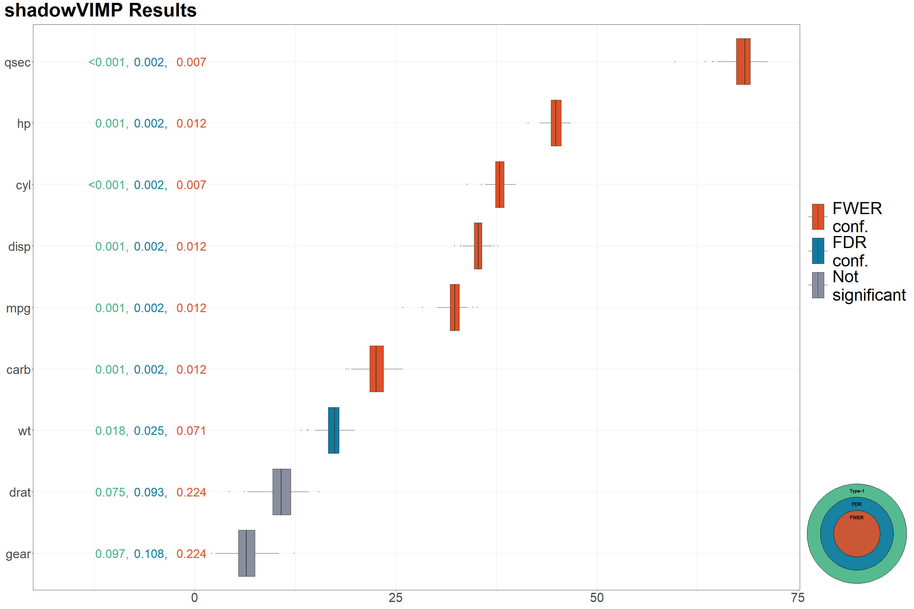

<!-- README.md is generated from README.Rmd. Please edit that file -->

# shadowVIMP

<!-- badges: start -->
<!-- badges: end -->
<!-- keep`README.md` up-to-date -> use`devtools::build_readme()`-->

## Overview

The goal of shadowVIMP is to provide a tool that allows the selection of
informative covariates in an informed manner. The method implemented in
this package is based on testing the variable importance measures (VIMP)
obtained from the random forest (RF). It also allows the user to
conveniently visualise the variables considered as informative on the
box plot. It is a convenient alternative to the standard approach,
e.g. selecting the top n variables, selecting only those variables with
an importance score above the predefined threshold. Details of the
method, realistic example of usage and interpretation of the results can
be found in `vignette("shadowVIMP-vignette")`.

## Installation

The `shadowVIMP` package is not (yet!) available on Cran. You can
install the development version like this:

``` r
devtools::install_gitlab("oktawia.miluch/shadowVIMP-package", host = "gitlab.staburo.de")
```

## Usage

Imagine you are working with a dataset with many variables and you want
to select the subset of the most informative covariates. Instead of
computing the variable importance (VI), displaying it on variable
importance plots, and (somewhat arbitrarily) selecting the set of
informative features, you can use the method implemented in this package
and select the subset of features in a more robust way. The following
example shows the basic use case.

``` r
library(shadowVIMP)
library(magrittr)

data(mtcars)

# For reproducibility
set.seed(789)

# Standard usage - sequential computing
# When working with real data, increase the value of the nsims parameter or leave it at the default value
 vimp_seq <- vim_perm_sim_wrapper(entire_data = mtcars, outcome_var = "vs", nsims = c(30, 100, 150))
#> alpha  0.3  
#> 2024-11-06 15:53:20: dataframe = mtcars nsim = 30 num.trees = 10000. Running step 1
#> Variables remaining:  10 
#> alpha  0.1  
#> 2024-11-06 15:53:26: dataframe = mtcars nsim = 100 num.trees = 10000. Running step 1
#> 2024-11-06 15:53:33: dataframe = mtcars nsim = 100 num.trees = 10000. Running step 50
#> 2024-11-06 15:53:39: dataframe = mtcars nsim = 100 num.trees = 10000. Running step 100
#> Variables remaining:  9 
#> alpha  0.05  
#> 2024-11-06 15:53:40: dataframe = mtcars nsim = 150 num.trees = 10000. Running step 1
#> 2024-11-06 15:53:46: dataframe = mtcars nsim = 150 num.trees = 10000. Running step 50
#> 2024-11-06 15:53:54: dataframe = mtcars nsim = 150 num.trees = 10000. Running step 100
#> 2024-11-06 15:54:00: dataframe = mtcars nsim = 150 num.trees = 10000. Running step 150
#> Variables remaining:  7

# Print informative covariates according to the pooled criterion (with and without p-value correction)
 vimp_seq$final_dec_pooled
#>   varname quantile_pooled      p_unadj   p_adj_FDR  p_adj_FWER Type1_confirmed
#> 1     cyl       0.9992598 0.0007401925 0.002467308 0.007401925               1
#> 2    qsec       0.9992598 0.0007401925 0.002467308 0.007401925               1
#> 3     mpg       0.9985196 0.0014803849 0.002467308 0.011843079               1
#> 4    disp       0.9985196 0.0014803849 0.002467308 0.011843079               1
#> 5      hp       0.9985196 0.0014803849 0.002467308 0.011843079               1
#> 6    carb       0.9985196 0.0014803849 0.002467308 0.011843079               1
#> 7      wt       0.9822354 0.0177646188 0.025378027 0.071058475               1
#> 8    drat       0.9252406 0.0747594375 0.093449297 0.224278312               0
#> 9    gear       0.9030348 0.0969652110 0.107739123 0.224278312               0
#>   FDR_confirmed FWER_confirmed
#> 1             1              1
#> 2             1              1
#> 3             1              1
#> 4             1              1
#> 5             1              1
#> 6             1              1
#> 7             1              0
#> 8             0              0
#> 9             0              0
 
# The significance level used for the test in the last step
  vimp_seq$alpha
#> [1] 0.05

# Check control parameters from the last step - you can specify what should be added to this list
  vimp_seq$control_parameters
#> NULL
  
# Are the displayed results from the last or the previous step?
  vimp_seq$result_taken_from_previous_step
#> [1] FALSE
  
# Check the time needed to execute each step of the algorithm and the entire procedure
  vimp_seq$time_elapsed
#> $step_1
#> [1] 0.09404811
#> 
#> $step_2
#> [1] 0.2305441
#> 
#> $step_3
#> [1] 0.3520235
#> 
#> $total_time_mins
#> [1] 0.6766157
  
# Check the call code that was used to create the inspected object
  vimp_seq$call
#> vim_perm_sim_wrapper(nsims = c(30, 100, 150), entire_data = mtcars, 
#>     outcome_var = "vs")
  
# Check VIMP measures of covariates and their shadows from the last step
  vimp_seq$vimp_history %>% head()
#>        mpg      cyl     disp       hp     qsec     carb       wt      drat
#> 1 32.96580 37.83467 34.28494 44.40825 69.39776 24.06262 15.92240  6.592342
#> 2 33.94531 37.67475 33.80626 43.52956 69.47350 22.87792 15.14960 11.407349
#> 3 30.08375 37.37923 35.83397 45.54814 63.48126 21.02905 19.53125  9.903495
#> 4 32.87286 37.27228 33.33198 44.62708 66.72462 21.53476 16.72543 12.559785
#> 5 33.31543 37.87766 35.51419 46.53287 68.73776 23.26442 16.94575 11.323333
#> 6 32.14069 37.56510 34.74886 45.31037 67.73211 22.76118 17.46005 10.717524
#>       gear mpg_permuted cyl_permuted disp_permuted hp_permuted qsec_permuted
#> 1 5.764364    -6.069204  -3.32899537    -8.1562793    7.681771     16.844710
#> 2 4.598629     4.078202   2.89716983    13.9188568   18.325314     -4.697359
#> 3 6.940662    -3.242185   2.70553361     4.3478057   -1.002965     -3.033623
#> 4 8.191079     8.515609  -0.06092051     0.2708662   -5.778261      2.359071
#> 5 7.602294    -5.753136   0.34546070    -4.3777628    3.339719     16.449674
#> 6 7.541206    -5.267411  -0.50446983    -4.0950592   -1.733074     -5.538990
#>   carb_permuted wt_permuted drat_permuted gear_permuted
#> 1    -3.2699946   -6.661017     -2.508818     3.3687412
#> 2    -2.8813075   -1.537203     -8.378585    -1.6538532
#> 3    -4.7045122    9.585241     28.771112     7.1048423
#> 4    11.3272227    2.210888      1.430094    -2.1331894
#> 5     0.8828882   -6.429090     -4.002469     0.4812786
#> 6     0.1989782   -6.730972     -6.458763    -2.7823118
  
# Inspect in detail two steps of pre-selection
#  vimp_seq$pre_selection
```

You can visualize your results in the following way:



A more realistic and detailed example of how to use this package can be
found in `vignette("shadowVIMP-vignette")`.

## Getting help

If you encounter a clear bug, please file an issue with a minimal
reproducible example.
