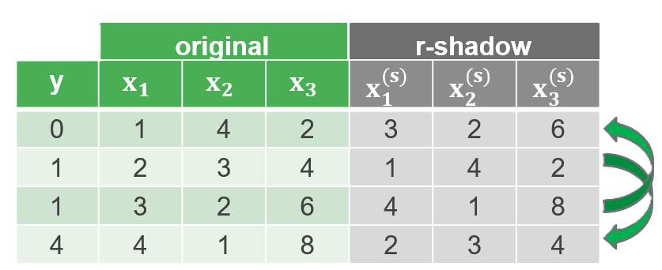
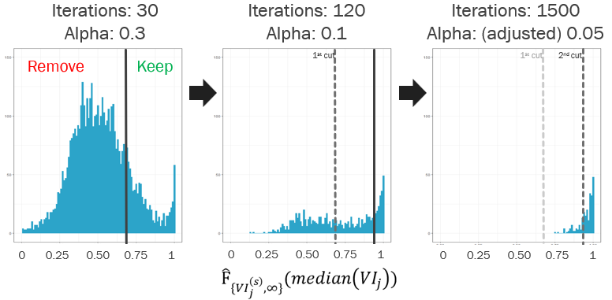

```{r, include = FALSE}
knitr::opts_chunk$set(
  collapse = TRUE,
  comment = "#>"
)
```

# Introduction to `shadowVIMP` package

## Theoretical framework

When working with high-dimensional data sets, one often wants to reduce the number of covariates considered. One way to do this is to run a Random Forest (RF) and compute the permutation variable importance (VIMP) for each predictor. In short, a VIMP of a covariate j measures the increase in a prediction error when variable j is randomly permuted. If a predictor j has a large impact on the predicted variable of interest, it will achieve a relatively large VIMP compared to other uninformative covariates. Then, the simplest way to decide which variables are informative would be to select the top n variables, or only those variables whose VIMP score is above the predefined threshold. 

While this approach is simple and fast, it does not ensure that the results are not due to chance. To make better, more reliable decisions, we need a more sophisticated method for selecting informative covariates (variables). This method should work like a statistical test and provide some assurance that the selected covariates are truly informative and not just chosen at random. This is where the `shadowVIMP` package comes in. The procedure implemented in the `shadowVIMP` package can be described as follows:

1. For p covariates included in the original data set, create p **r-shadow variables**. R-shadow variables are row-permuted copies of the original covariates (see the image below for a visualization of the permutation scheme). Repeat the permutation `nsim` times. Each permutation will result in a new set of r-shadow variables.

```{r, echo=FALSE, out.width="85%", fig.cap="Permutation scheme"}

```

2. For each of the `nsim` permutations, recompute the VIMP of the original and r-shadow covariates. As a result, you will get the following sets:

    * $VI_{j}$ - set of VIMPs of variable j, consisting of `nsim` (number of permutations) elements,
    * $VI_{j}^{(s)}$ -   set of VIMPs of r-shadows of variable j, consisting of `nsim` elements.
3. Calculate and decide whether a covariate j is significant based on its non-parametric p-value. The p-value for variable j is defined as follows:

$$p_{j} = 1 - \widehat{F}_{ \left\{VI_{j}^{(s)}, \infty \right\}}(median(VI_{j}))$$

where:

* $\widehat{F}_{\{VI_{j}^{(s)}, \infty\}}(\cdot)$ is an empirical cumulative distribution function (ECDF) based on the r-shadow VIMPs of variable j with an infinity added. The ECDF represents the proportion of r-shadow VIMPs that are less than or equal to a certain value (in our case $median(VI_{j})$). By including infinity in the data, we ensure that the ECDF covers all possible values up to infinity. In other words, if we query such a constructed ECDF with a specific value, it will return  $1$ if that value is greater than all observed VIMPs of the r-shadow variable.
* $median(VI_{j})$ is the median of the VIMPs of the original variables over all `nsin` iterations of the random forest.

In the rest of this tutorial, we will call this type of p-value **per variable p-value**. Overall, such a defined p-value represents a proportion of random forest iterations in which the r-shadow variable achieved a higher VIMP than the median of the original variable's VIMPs. The covariate $x_{j}$ is considered informative if, for a given significance level $\alpha$, the following inequality holds:

$$p_{j} \le \alpha$$

### High-dimensional data extension 1: pre-selection 

The method described above works well for low-dimensional data, but some modifications are needed for the high-dimensional case. The first improvement we need for a high-dimensional setting is the **pre-selection** of covariates. The goal of preselection is to eliminate noisy covariates from the procedure as early as possible. The idea is to reduce the set of predictors in one or more preliminary steps, where the algorithm is run with a significance level $\alpha$ less strict than the target value of $\alpha$ used for the final decision. For example, if the target value of the significance level is the usual $0.05$, then the appropriate value of $\alpha$ for the pre-selection step could be set to $0.3$. This would involve first running the basic algorithm (possibly with fewer iterations) against a threshold of $0.3$, identifying variables that have a p-value of at most $0.3$. Only the variables confirmed by this initial pre-selection step (i.e., with a p-value of at most $0.3$) would proceed either to the final step of the algorithm or to another pre-selection step (see figure below for illustration).

```{r, echo=FALSE, out.width="85%", fig.cap="Illustration of pre-selection procedure"}

```

The figure above illustrates the pre-selection procedure proposed in the `shadowVIMP' package. In this example, $30$ random forest models are trained in the first step. Based on the empirical cumulative distribution function (ECDF) built from the VIMPs of the r-shadow variables (obtained in $30 iterations of RF), only the covariates with a p-value less than or equal to $0.3$ are considered in the next step. The second round of pre-selection further reduces the set of considered variables against a significance threshold of $0.15$, based on $120$ random forest iterations. Only the covariates confirmed in the two pre-selection steps proceed to the final step. As a result, the final step only includes variables that showed early potential (survived the pre-selection) to exceed the target significance level of $0.05$.  

### Addressing multiple testing issue

The decision criterion discussed so far, namely the per variable p-value, was defined as $p_{j} = 1 - \widehat{F}_{\{VI_{j}^{(s)}, \infty\}}(median(VI_{j}))$. A key aspect of this criterion is the direct comparison of the VIMPs of the original variable with the VIMPs of its corresponding r-shadow variable. However, in practice, when analyzing high-dimensional data, one needs to account for the multiple testing issue by using an appropriate adjustment method. The `shadowVIMP` package provides two adjustment procedures:  Benjamini-Hochberg (BH), which controls for the expected false discovery rate (FDR), and the Holm procedure, which controls for the family-wise error rate (FWER).

### High-dimensional data extension 2: pooled p-value

In the considered setting of permorming many statistical tests, the application of multiple testing adjustment method is necessary. However, it also implies the need to calculate very small p-values. To put things into practical perspective, let's say we have $5000$ predictors in our data set, the target significance level is $0.05$, and we want to apply BH adjustment. In such a setting, the first significance threshold is $0.05/5000 = 0.00001$. This means that in order to reject the null hypothesis (a covariate is uninformative) about the variable with the smallest p-value, the corresponding p-value should be at most $0.00001$. Given the present definition of p-value, the smallest achievable p-value is $\frac{1}{n_{sim}}$. Therefore, to achieve a p-value lower than the significance threshold, we would need $\frac{5000}{0.05} = 100000$ iterations of the random forest (`n_sim`). Performing such a large number of iterations would be computationally expensive.  

To reduce this cost, we introduce an alternative decision criterion: **pooled p-value**. The main idea behind pooling is to increase the sample size of the ECDF by including the VIMPs of all r-shadows instead of just the corresponding one. The pooled p-value for covariate j is defined as follows:

$$
p_j^{(\text{pooled})} = 1 - \widehat{F}_{ \left\{ \widetilde{VI}_{1}^{(s)}, \dots, \widetilde{VI}_{j}^{(s)}, \dots, \widetilde{VI}_{p}^{(s)}, \infty \right\} } \left( \text{median} \left( \widetilde{VI}_{j} \right) \right)
$$


where $\widetilde{VI}_{j}^{(s)}$ is a standardized r-shadow VIMP:

$$
\widetilde{VI}_{j}^{(s)} = \frac{VI_{j}^{(s)} - \text{mean}(VI_{j}^{(s)})}{\text{sd}(VI_{j}^{(s)})}
$$
and $\widetilde{VI}_{j}$ is a "standardized" VIMP of the original covariate, corrected using the mean and standard deviation of its corresponding r-shadow:

$$
\widetilde{VI}_{j} = \frac{VI_{j} - \text{mean}(VI_{j}^{(s)})}{\text{sd}(VI_{j}^{(s)})}
$$
Similar to per-variable p-values, when using the alternative formulation of the decision criterion, the covariate j is considered informative if:

$$ p_j^{(\text{pooled})} \leq \alpha $$
The main advantage of pooled p-values is the reduced run time.  Using the same example with $5000$ predictors as before, the smallest achievable p-value is $\frac{1}{n_{sim} \times 5000}$. The pooled decision criterion reduces the number of iterations required, making it possible (though not guaranteed) to reject at least one hypothesis, by a factor of $5000$ (or, in general, by the number of covariates included in the data).

### Back to pre-selection

Coming back to the idea of pre-selection, we could perform the pre-selection steps of the proposed method based on either per-variable or pooled p-values. However, in the current implementation of the `shadowVIMP` package, we use the pooled decision criterion in the preselection steps. This approach allows us to use a comparatively small number of iterations in the preselection steps while still maintaining a reasonable number of VIMPs used to construct the ECDF. In the final step of the procedure, the user can decide whether to report per-variable or pooled p-values along with the decisions based on them. More on this topic in the following practical guide to the `shadowVIMP` package.

## Quick start

The purpose of this section is to give users a general idea of the package. We will briefly go through the main functions, possible values of their arguments, outputs and their interpretation. 

First, let's install the `shadowVIMP` package. The `shadowVIMP` package is not (yet!) available on Cran, but you can install the development version like this:

``` {r, eval = FALSE}
devtools::install_gitlab("oktawia.miluch/shadowVIMP-package", host = "gitlab.staburo.de")
```

Then, we load necessary packages:
```{r setup, warning = FALSE, message = FALSE}
library(shadowVIMP)
library(magrittr)
library(dplyr)

if (requireNamespace("AppliedPredictiveModeling", quietly = TRUE)) {
    library(AppliedPredictiveModeling)
} else {
    stop("Package 'AppliedPredictiveModeling' is required for this vignette. Please install it.")
}

```

In the examples below we use Alzheimer’s Disease CSF Data from the `AppliedPredictiveModeling` package. To reduce the time needed to build this vignette, we use the subset of the original data (100 observations taken from the original dataset) and smaller than recommended values of `nsims` parameters.If you are working on a real-life example, please keep the default values of `nsims` or at least increase the values used below. In the example below, we show the basic usage of our package with the default settings. By default, the functions of this package use sequential computation and display informative covariates according to the pooled p-values. The default settings also display all possible p-values, namely unadjusted, FWER-adjusted and FDR-adjusted.

```{r ex_default}
data(AlzheimerDisease)
data_alz <- cbind(diagnosis, predictors)
# To make the results reproducible
set.seed(786)
data_sub <- slice_sample(data_alz, n = 100)
vimp_def <- vim_perm_sim_wrapper(nsims = c(20,30,50), entire_data = data_sub, outcome_var = "diagnosis")

```

As shown below, in this case none of the variables are informative when applying the Holm p-value correction (column `FWER_confirmed`). Using the FDR p-value correction, the first 5 covariates appear to be informative.  

````{r ex_default2}
vimp_def$final_dec_pooled %>% 
  select(-quantile_pooled) %>% 
  head()
````

## Decide what will be stored in your output

The `vim_perm_sim_wrapper()` function has a `save_vimp_history` argument. This argument allows the user to decide what should be saved in the output object. By default it is set to `"all"`, which means that variable importance measures from all steps of the procedure are saved. Returning to the object created in the previous paragraph, one can inspect the variable importance from the simulations performed in the first or second step of the procedure by running:

````{r inspect_history1}
# VIMP history from the 1st step
vimp_def$pre_selection$step_1$vimp_history %>% 
  select(1:6) %>% 
  head()

# VIMP history from the 2nd step
vimp_def$pre_selection$step_2$vimp_history %>%
  select(1:6) %>% 
  head()
````

The code below allows you to check the VIMP (Variable Importance) measures from the last step:

````{r vimp_last_step}
vimp_def$vimp_history %>% 
  select(1:6) %>% 
  head()
````

Setting the parameter `save_vimp_history` to the value `"last"` will only save the variable importance from the last step of the procedure. Compared to the default setting (which sets `save_vimp_history` to `"all"`), under `pre_selection$step_1` or `pre_selection$step_2` there will be no data frame storing the variable importance obtained during the preselection phase. 

````{r vimp_last}
vimp_last <- vim_perm_sim_wrapper(nsims = c(20,30,50), entire_data = data_sub, outcome_var = "diagnosis", save_vimp_history = "last")

# Inspect VIMP from the last step of the procedure
vimp_last$vimp_history %>%
  select(1:6) %>% 
  head()

# There is no `vimp_history`data frame under `pre_selection$step_1` or `pre_selection$step_2`
# vimp_last$pre_selection$step_1
# vimp_last$pre_selection$step_2
````

If the parameter `save_vimp_history` is set to the value `"none"`, the variable importance of each step will not be saved. As shown below, under `vimp_history` there is no longer a data frame to store variable importance measures. Similarly, if you run `vimp_none$pre_selection$step_1` or `vimp_none$pre_selection$step_2`, as in the previous example, you will no longer find data frames storing VIMP from the preselection phase.

````{r vimp_none}
vimp_none <- vim_perm_sim_wrapper(nsims = c(20,30,50), entire_data = data_sub, outcome_var = "diagnosis", save_vimp_history = "none")
vimp_none$vimp_history

````

## Parallelisation

To speed up the computation, it is possible to run the main function of the `shadowVIMP` package in parallel. There are two ways to do this. The first is to use the parallelisation provided by the `ranger::ranger()` function, which is used internally. To use this functionality, the `num.threads` parameter must be set to a value greater than 1.

````{r parallel1}
vimp_parallel1 <- vim_perm_sim_wrapper(nsims = c(20,30,50), entire_data = data_sub, outcome_var = "diagnosis", num.threads = 4)
````

Another way to perform parallel computations is to set the `num_cores_parallel` parameter to a value greater than 1. In this case, a cluster with the specified number of cores is created under the hood.

````{r parallel2}
# Technical checks 
# Detect if running on non-interactive environments
is_interactive <- interactive()

if(is_interactive){
  # When interactive - run parallel
  num_cores <- min(parallel::detectCores(), 4)
  vimp_parallel2 <- vim_perm_sim_wrapper(nsims = c(20,30,50), entire_data = data_sub, outcome_var = "diagnosis",
                                         num_cores_parallel = num_cores)
} else {
  # When non-interactive - run sequantial
  vimp_parallel2 <- vim_perm_sim_wrapper(nsims = c(20,30,50), entire_data = data_sub, outcome_var = "diagnosis")
}
````

Of course, it is possible to use two types of parallelisation at the same time, but this is not recommended by the authors of the package. In any case, it is important to set the value of these parameters so that they do not exceed the number of cores available on your machine. If you are unsure about the number of cores available on your machine, run `parallel::detectCores()`. Note that if you are working with small datasets or too small values of the `nsims` parameter, the benefit of parallelisation (if any) will be negligible.
 
## Choose decision criteria (pooled or per variable p-value)

The `shadowVIMP` package also provides an option to select informative covariates based on the `per variable` p-values. By default, the printed decision whether a covariate is informative or not is based on the pooled p-value. In the output below, the decision about the informativeness of covariates is based on the per-variable p-value:

````{r per_variable}
vimp_per_variable <- vim_perm_sim_wrapper(nsims = c(20,30,50), entire_data = data_sub, outcome_var = "diagnosis", method = "per_variable")

vimp_per_variable$final_dec_per_variable %>% 
  select(-quantile_per_variable) %>%
  head()
````

As shown in the output above, when using p-values per variable, after applying FWER or FDR correction, no variable appears to be informative. At this point it is very important to remind the reader that (in order to reduce the time needed to compile this vignette) the values of the `nsims` parameter used in this example are much too low. To get reliable results, `nsims` should be set to higher values.

## Additional entries in the output

So far we have discussed the contents of the `vimp_history` and `final_dec_pooled` (or `final_dec_per_variable`) elements stored in the output of the `vim_perm_sim_wrapper()` function. Besides that, there are a few other items stored in the output. To demonstrate some of them, let's use the output from the previous paragraph again. As shown below, the `alpha` entry stores the value of the significance level $\alpha$ used in the last step of the procedure:

````{r alpha}
vimp_per_variable$alpha
````

The next element in the output of the `vim_perm_sim_wrapper()` function is the `result_taken_from_previous_step` entry.  If `result_taken_from_previous_step` is `TRUE`, then no variables survived the preselection process, so the reported results are taken from one of the previous steps. If it is set to `FALSE` (as below), the results presented in the output have been obtained in the last step of the procedure.

````{r from_last_step}
vimp_per_variable$result_taken_from_previous_step
````

`time_elapsed` is a list containing the runtime of each step and the total time taken to execute the code, while `call` stores the call formula used to generate the output.

````{r time}
vimp_per_variable$time_elapsed
vimp_per_variable$call
````

Another entry in the output object is the `control_parameters' list. The user can specify what else should be stored in this list, but by default only the number of simulations from the last step is stored (see below).

````{r control_params}
# The default
vimp_per_variable$control_parameters
````

Let's say we want to select the informative covariates based on the per variable  p-values, and we want to store the type of p-values used in the `control_parameters` list. To do this, we need to execute the following code:

<!-- # TODO : remove warnings = FALSE once you resolve the underlying issue  -->

````{r add_control, warning = FALSE}
# Custom `control_parameters` list
vimp_per_var_control <- vim_perm_sim_wrapper(nsims = c(20,30,50), entire_data = data_sub, outcome_var = "diagnosis", method = "per_variable", p_val_type = c("per variable p-value"))

vimp_per_var_control$control_parameters
````

The last entry in the output of the `vim_perm_sim_wrapper()` function is the `pre_selection` list. This list consists of two sublists: `step_1` and `step_2`. Let's focus on the `step_1` sublist (the structure of `step_2` is identical). By default, this list has the following 4 elements:

- `vimp_history` - data frame storing variable importance measures,
- `decision_per_variable` - data frame with p-values and decision whether a given covariate is informative,
- `alpha` - the significance level used in the first step of the procedure,
- `control_parameters` - by default the value of the `nsims` parameter used in the first step, but also, as shown below, the character indicating the type of p-values on which the final decision was based.

The structure of the `pre_selection` list changes only if the user sets the parameter `save_vimp_history` to `last` or `none`. If one of these two options is chosen, there will be no `vimp_history` data frame for any of the preselection steps. The structure of the remaining three elements remains unchanged.

The code below demonstrates the described entries based on the example of the `vimp_per_var_control` object created in the previous chunk of code.

````{r pre_selection}
# VIMP from 1st step
vimp_per_var_control$pre_selection$step_1$vimp_history %>% 
  select(1:6) %>% 
  head()

# Which covariates were considered as informative in the 1st step?
vimp_per_var_control$pre_selection$step_1$decision_per_variable %>% 
  select(-quantile_per_variable) %>% 
  head()

# The significance level used in the 1st step
vimp_per_var_control$pre_selection$step_1$alpha

# Control parameters used in the 1st step
vimp_per_var_control$pre_selection$step_1$control_parameters

````

## Plot your results

Let's use again the results obtained at the beginning of this tutorial, namely the following object:

````{r reminder,  eval = FALSE}
vimp_def <- vim_perm_sim_wrapper(nsims = c(20,30,50), entire_data = data_sub, outcome_var = "diagnosis")

````

Instead of just looking at the table that stores the decisions from the last step about informative covariates, we would like to have an appealing visual representation of our results. In the `shadowVIMP` package this is easily accessible using the `plot_vimps()` function. If you want to plot the results based on the pooled p-values, just specify the output of the `vim_perm_sim_wrapper()` function as shown below: 

````{r plot_base, fig.width=13, fig.asp=0.8, out.width="115%"}
plot_vimps(wrapper_object = vimp_def)
````

The boxplots from the figure above show the VIMP measures obtained for each covariate from the `nsims` simulations performed in the last step of the procedure. The numbers on the left of the boxplots are unadjusted, FDR-adjusted and FWER-adjusted p-values respectively. To control the size of the plotted p-values, increase the value of the `text_size` parameter in the `plot_vimps()` function. It is set to 3 by default.

If you only want to display a certain number of covariates, let's say 10, you can do this by setting the `filter_vars` parameter to the desired value, as shown below:

````{r filter_vars, fig.width=13, fig.asp=0.8, out.width="115%"}
plot_vimps(wrapper_object = vimp_def, filter_vars = 10, text_size = 4)
````

If you are working with a large dataset and many covariates survive to the last step of the procedure, it is recommended to specify the value of the `filter_vars` parameter to keep your plot readable.

Let's use again the results of the proposed procedure based on per variable p-values (other parameters remain at their default values):

````{r plot_per_var, eval=FALSE}
vimp_per_variable <- vim_perm_sim_wrapper(nsims = c(20,30,50), entire_data = data_sub, outcome_var = "diagnosis", method = "per_variable")
````

To use the `plot_vimps()` function for results based on per variable p-values, the `pooled` parameter in the plot function must be set to `FALSE`:

````{r plot_per_var2, fig.width=13, fig.asp=0.8, out.width="115%"}
plot_vimps(wrapper_object = vimp_per_variable, pooled = FALSE)
````

