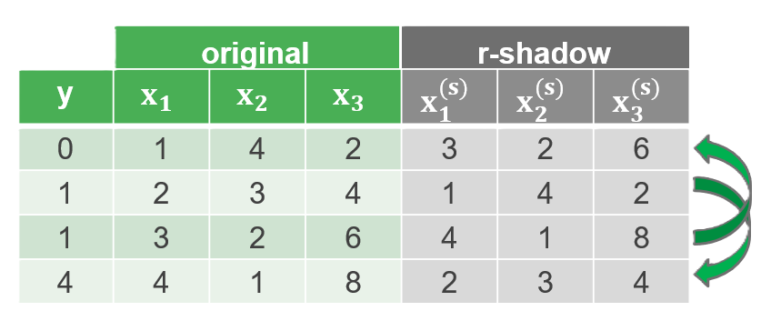
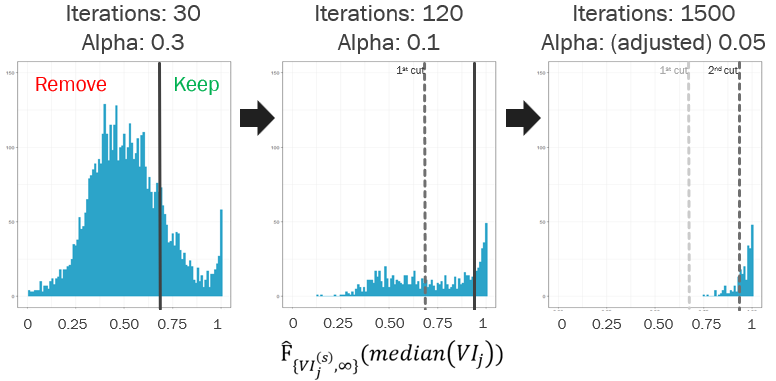

```{r, include = FALSE}
knitr::opts_chunk$set(
  collapse = TRUE,
  comment = "#>",
  fig.path   = "figure-html/",
  fig.width  = 12,
  fig.height = 8 
)
```

# Introduction to `shadowVIMP` package

## Quick start 

The purpose of `shadowVIMP` package is to provide a tool for reducing the number of covariates in an analysis in an informed and statistically rigorous manner. It implements a method that performs statistical tests on the Variable Importance Measures (VIMP) derived from the Random Forest (RF) algorithm to determine whether each covariate is statistically significant and truly informative.

In this section, we demonstrate a basic use case of the `shadowVIMP` package. First, let's install the package:

``` {r, eval = FALSE}
install.packages("shadowVIMP")
```

Then, we load necessary packages:
```{r setup, warning = FALSE, message = FALSE}
library(shadowVIMP)
library(magrittr)
library(dplyr)
library(ggplot2)
```

In the examples below, we use the well-known toy dataset `mtcars`. Our variable of interest is the `vs` covariate, which indicates whether the car’s engine is V-shaped or straight. To speed up vignette building, we set `niters` parameter lower than recommended. For real-world analyses, please use the default or a higher value - otherwise, the results will **not** be reliable. The example that follows demonstrates our package’s basic usage. By default, its functions display informative covariates based on p-values computed by using the “pooled” approach and report all p-value types: unadjusted, FWER-adjusted, and FDR-adjusted.

```{r ex_default}
data("mtcars")
set.seed(786)

is_interactive <- interactive()
if (is_interactive) {
  # When interactive - set num_cores to a selected value
  global_num_threads <- min(parallel::detectCores()/2, 6)
} else{
  # Value of num.threads parameter for CRAN 
  global_num_threads <- 1
}

# WARNING 1: The specified values of the niters parameter are too small! To get reliable results, use the default or higher values of the niters parameter.
# WARNING 2: To avoid potential issues with parallel computing on CRAN, we set num.threads to 1, by default it is set to half of the available CPU cores, which speeds up computation.
vimp_def <- shadow_vimp(data = mtcars, outcome_var = "vs", niters = c(20, 30, 50),
                        num.threads = global_num_threads)
vimp_def
```

By default, printing the results displays:

* the call formula,
* the significance level used at each step of the procedure,
* the number of covariates retained at each step (column "Retained Covariates")
* the number of significant covariates identified at the final step according to unadjusted, FDR-adjusted, and FWER-adjusted p-values (columns "Type-1 Confirmed", "FDR Confirmed" and "FWER Confirmed", respectively)

To examine the exact p-values and corresponding decisions in more detail, inspect the `final_dec_pooled` element of the output (or `final_dec_per_variable` if `method = "per_variable"`).

````{r ex_default2}
vimp_def$final_dec_pooled %>%
  head()
````

You can visualise your results by running the following code:

````{r plot_base_starts, eval=TRUE}
plot_vimps(shadow_vimp_out = vimp_def)
````

## Theoretical framework

### Motivation

When working with high-dimensional data, it is often desirable to reduce the number of covariates under consideration. This objective is especially important when determining which variables contribute most to the accuracy of the model, and therefore best explain the outcome of interest. There are several established methods of variable selection. The `shadowVIMP` package introduces a new variable selection method based on variable importance (VIMP) from the random forest (RF) algorithm. In short, VIMP in a random forest quantifies the contribution of each predictor variable to the accuracy of the model. It helps to identify which variables have the greatest influence on the modelled outcome. VIMPs only allow us to rank covariates by their relative importance, but the absolute magnitude of a VIMP is context dependent, i.e. there is no universal cut-off for identifying truly important variables. Therefore, a simple approach of selecting covariates with a VIMP above a certain threshold is not appropriate as it could lead to arbitrary choices. Another possible approach is to select the top *n* predictors (e.g. top 5, 10 or 20), but this approach risks missing important variables or selecting false positives, especially if few or none of the covariates are related to the outcome. Therefore, a more reliable approach is needed to ensure that observed VIMPs are not simply due to chance. This is where the `shadowVIMP` package comes in. `shadowVIMP` provides a statistical framework for assessing whether a given VIMP is large enough to be considered statistically significant.

### Big picture

We aim to perform a statistical test to determine whether the variable importance measure (VIMP) of a given covariate is statistically significant at a specified significance level. However, since the null distribution of the VIMP is unknown, this poses a challenge. The `shadowVIMP` package provides the following solution to address this issue:

1. **Approximate null distribution of the VIMPs for each variable**: For each predictor, we create an r-shadow variable by permuting (shuffling) the rows of the original data, effectively breaking any real association with the outcome. This permutation process is repeated *niters* times,  with the VIMP recalculated after each permutation. After performing *niters* permutations, the resulting VIMPs for the r-shadow variable form an approximate distribution of that variable under the null hypothesis, i.e. assuming that the predictor has no true association with the outcome.
2. **Calculate p-values**: Determine the proportion of iterations in which the VIMP of the randomly permuted variable exceeds the median VIMP of the original variable. 
3. **Compare p-values**: Compare the calculated p-values to the pre-specified significance level to make the final decision.

### Details

The procedure implemented in the `shadowVIMP` package can be described as follows:

1. For each of the *p* covariates in the dataset, create *p* r-shadow variables by permuting rows of copied original covariates, thereby removing any association with the outcome (see the figure below). These uninformative r-shadow variables serve as a reference for evaluating the importance of the original predictors. Repeat this permutation process *niters* times, generating new r-shadow variables in each iteration.

```{r, echo=FALSE, out.width="85%", fig.cap="Permutation scheme"}

```

2. For each of the niters permutations, fit the random forest model and calculate the VIMPs for both the original and corresponding r-shadow covariates. After *niters* iterations, the algorithm produces a data frame with *niters* rows and *2p*  columns, containing VIMPs for each of the original and r-shadow variables. Permuting the data removes any existing relationship between predictors and the outcome. The VIMPs computed from the r-shadow covariates across many permutations form an approximate null distribution for each original predictor, representing the scenario in which the predictor has no true association with the outcome. By comparing the observed VIMP to this null distribution, you estimate how likely it is that the observed importance occurred purely by chance.

3. Calculate and decide whether a covariate *j* is significant based on its non-parametric p-value. The p-value for variable *j* is defined as follows:

$$p_{j} = 1 - \widehat{F}_{ \left\{VI_{j}^{(s)}, \infty \right\}}(median(VI_{j}))$$

where:

* $\widehat{F}_{\{VI_{j}^{(s)}, \infty\}}(\cdot)$ is an empirical cumulative distribution function (ECDF) based on the r-shadow VIMPs of variable *j* with an infinity added. Adding infinity to the ECDF introduces a small offset to prevent p-values being exactly 0.
* $median(VI_{j})$ is the median of the VIMPs of the original variables over all `nsin` iterations of the random forest.

In the remainder of this tutorial, we will refer to the p-values obtained using the above-presented per-variable approach simply as **per-variable p-value**. Such a defined p-value represents a proportion of iterations in which the r-shadow variable achieved a higher VIMP than the median VIMP of the original variable. The covariate $x_{j}$ is considered informative if, for a given significance level $\alpha$, the following inequality holds:

$$p_{j} \le \alpha$$

#### Pooled p-value

When performing numerous statistical tests, the application of multiple testing adjustment method is necessary. This requires calculating very small p-values. For example, with $5,000$ predictors in the data set and a target significance level of $0.05$, when using the Benjamini-Hochberg (BH) adjustment, the first significance threshold is $0.05/5000 = 0.00001$. This means that to reject the null hypothesis (a covariate is uninformative) for the variable with the smallest p-value, its p-value must be $\leq 0.00001$. Given the present definition of p-value, the smallest achievable p-value is $\frac{1}{n_{sim}}$. Therefore, to achieve a p-value lower than the significance threshold, we would need $\frac{5000}{0.05} = 100000$ iterations of the random forest. Performing such a large number of iterations would be computationally expensive. 

To reduce computational cost, we introduce the p-values obtained using the pooled approach, which we call **pooled p-value** for short, as an alternative decision criterion. Pooling increases the effective sample size of the ECDF by incorporating VIMP values of all r-shadow variables instead of just one. Before pooling,  it is essential to standardise the r-shadow VIMPs to ensure comparable distributions. The pooled p-value for covariate *j* is then defined as follows:

$$
p_j^{(\text{pooled})} = 1 - \widehat{F}_{ \left\{ \widetilde{VI}_{1}^{(s)}, \dots, \widetilde{VI}_{j}^{(s)}, \dots, \widetilde{VI}_{p}^{(s)}, \infty \right\} } \left( \text{median} \left( \widetilde{VI}_{j} \right) \right)
$$


where $\widetilde{VI}_{j}^{(s)}$ is a set of standardised r-shadow VIMPs and $\widetilde{VI}_{j}$ is the standardised VIMP of the original covariate $x_{j}$. Similar to per-variable p-values, when using the alternative decision criterion, the covariate j is considered informative if:

$$ p_j^{(\text{pooled})} \leq \alpha $$
The main advantage of pooled p-values is the reduced run time. Using the same example with $5000$ predictors as before, the smallest achievable p-value is $\frac{1}{n_{sim} \times 5000}$. The pooled decision criterion decreases the number of required iterations by a factor of 5,000 (or, more generally, by the number of covariates included in the data), making it possible (though not guaranteed) to reject at least one hypothesis. For analyses involving multiple testing adjustment, the authors of the paper behind this package strongly **recommend adopting the pooled decision criterion**.

#### Pre-selection 

The method described above works well for low-dimensional data, but high-dimensional settings require modifications. The first improvement we need for a high-dimensional setting is the **pre-selection** of covariates to eliminate uninformative variables early on. This involves reducing the set of predictors in one or more preliminary steps using a less strict significance level ($\alpha$) than the final target (e.g., $\alpha = 0.3$ for pre-selection when the final $\alpha = 0.05$). The figure below illustrates the pre-selection procedure implemented in the `shadowVIMP` package.

```{r, echo=FALSE, out.width="85%", fig.cap="Illustration of pre-selection procedure"}

```

**Pre-selection process**:

1. **Initial pre-selection**: Run the algorithm with $\alpha = 0.3$ (possibly with fewer iterations, here $30$) to identify variables with p-values $ \leq 0.3$.
2. **Second step of pre-selection** (optional): Further reduce the set of variables by applying a stricter threshold (e.g., $\alpha = 0.1$) using more RF iterations (here $120$).
3. **Final selection**: Only variables that pass all the pre-selection steps proceed to the final step of the algorithm, ensuring that they have the potential to meet the target significance level of $0.05$.

The current implementation of the `shadowVIMP` package uses pooled p-values in the pre-selection steps. In the final step of the procedure, the user can decide whether to report per-variable or pooled p-values along with the decisions based on them. More on this topic in the following practical guide to the `shadowVIMP` package.
 
#### Addressing multiple testing issue

The defined decision criterion, namely the per-variable p-value, directly compares the VIMPs of the original variable with with the VIMPs of its corresponding r-shadow variable. In practice, especially when analysing high-dimensional data, multiple testing should be addressed by appropriate p-value adjustment method. The `shadowVIMP` package provides two adjustment procedures:  Benjamini-Hochberg (BH), which controls for the expected false discovery rate (FDR), and the Holm procedure, which controls for the family-wise error rate (FWER) 

## Hands-on insights: mastering `shadowVIMP`
### Select output components

The `shadow_vimp()` function has a `save_vimp_history` argument, allowing users to specify what is stored in the output object. By default, it is set to `"all"`, which saves variable importance measures from every step of the procedure. By using the previously created object `vimp_def`, let's inspect the VIMPs from the first and the second steps of the pre-selection phase:

````{r inspect_history1}
# Reminder - definition of vimp_def object:
# set.seed(786)
# vimp_def <- shadow_vimp(data = mtcars, outcome_var = "vs", niters = c(20, 30, 50),
#                         num.threads = global_num_threads)

# VIMP history from the 1st step for 5 covariates:
vimp_def$pre_selection$step_1$vimp_history %>%
  select(1:5) %>%
  head()

# VIMP history from the 2nd step for 5 covariates:
vimp_def$pre_selection$step_2$vimp_history %>%
  select(1:5) %>%
  head()
````

To check the VIMP values from the last, final step run:

````{r vimp_last_step}
vimp_def$vimp_history %>%
  select(1:5) %>%
  head()
````

Alternatively, by setting `save_vimp_history` to `"last"`, only the variable importance measures from the final step of the procedure are saved. Unlike the default setting, this option does not retain VIMPs obtained during the pre-selection phase. Finally, you can completely disable saving of variable importance measures by setting `save_vimp_history` to `"none"`.

You can also specify which p-value adjustment should be applied to your results. To do that, select the appropriate value for the `to_show` parameter. There are three available options:

* `"FWER"`: All three types of p-values (FWER, FDR, and unadjusted) will be displayed along with the corresponding decisions.
* `"FDR"`: Only FDR and unadjusted p-values, along with their decisions, will be displayed.
* `"unadjusted"`: The raw, unadjusted p-values will be shown together with the decisions if the covariate is informative.

By default, the `shadow_vimp()` function chooses the "FWER" option, displaying all three decisions. You can change it to "FDR" or "unadjusted" as follows:

```{r fdr_unadjusted_dec}
# Show FDR and unadjusted p-values
vimp_fdr <- shadow_vimp(data = mtcars, outcome_var = "vs",
                        to_show = "FDR", niters = c(20, 30, 50),
                        num.threads = global_num_threads)
vimp_fdr

# Show only unadjusted p-values
vimp_unadjusted <- shadow_vimp(data = mtcars, outcome_var = "vs",
                               to_show = "unadjusted", niters = c(20, 30, 50),
                               num.threads = global_num_threads)
vimp_unadjusted
```

### Choose decision criteria for the final decision

By default, the decision on whether a covariate is informative is based on the pooled p-value. However, per-variable p-values can also be used to select informative covariates in the final step of the procedure. In the output below, the informativeness of covariates is determined based on per-variable p-values:

````{r per_variable}
vimp_per_variable <- shadow_vimp(data = mtcars, outcome_var = "vs",
                                 method = "per_variable", niters = c(20, 30, 50),
                                 num.threads = global_num_threads)

vimp_per_variable$final_dec_per_variable %>%
  head()
````

As demonstrated in the output above, the use of per-variable p-values may lead to different conclusions than when pooled p-values are used. Nevertheless, **we strongly recommend using pooled p-values** to obtain reliable and robust results.

### Output structure

So far, we have explored the `vimp_history` and `final_dec_pooled` (or `final_dec_per_variable`) components from the output of the `shadow_vimp()` function. The function also returns several additional useful components. To illustrate these clearly, let’s revisit the results obtained earlier in this tutorial (in the "Quick Start" section), specifically the following object:

````{r reminder}
# Definition of vimp_def:
# vimp_def <- shadow_vimp(data = mtcars, outcome_var = "vs", niters = c(20, 30, 50),
#                         num.threads = global_num_threads)
vimp_def
````

The structure of the printed results was already discussed in Section "Quick start", but the output of the `shadow_vimp()` function contains additional components to explore. For example, the `time_elapsed` entry provides the runtime of each individual step as well as the total execution time of the algorithm:

````{r time}
vimp_def$time_elapsed
````

Under the `alpha`, you can inspect the significance levels used at each step. The `step_all_covariates_removed`entry indicates whether all covariates were eliminated before the final step (a positive integer giving the step at which removal occurred) or if at least one covariate survived through to the last step (value `0`):

````{r minor}
vimp_def$alpha
vimp_def$step_all_covariates_removed
````

The final component of the `shadow_vimp()`  function's output is the `pre_selection` list, which includes two sublists (`step_1` and `step_2` in the case of `vimp_def` object). Each sublist contains:

* `vimp_history` - data frame storing `niters` VIMPs of original covariates and their r-shadows,
*  decision_pooled` - data frame containing p-values and decisions on whether each covariate is informative at a given step,
* `alpha` - the significance level applied during the respective pre-selection step.

The structure of the `pre_selection` list changes only if `save_vimp_history` is set to `last` or `none`. If one of these two options is chosen, `vimp_history` data frame will not be included for any pre-selection steps. The other two elements remain unchanged.

The code below demonstrates the described entries using `vimp_def` object.

````{r pre_selection}
# VIMP from 1st step
vimp_def$pre_selection$step_1$vimp_history %>%
  select(1:5) %>%
  head()

# Which covariates were considered as informative in the 1st step?
vimp_def$pre_selection$step_1$decision_pooled %>%
  head()

# The significance level used in the 1st step
vimp_def$pre_selection$step_1$alpha
````

### Plot your results

In this part of the tutorial, we will continue working with the results obtained previously. Specifically, we will use the `vimp_def` object created earlier. Instead of just looking at the table that stores the decisions from the last step of our procedure, we would like to have an appealing visual representation of our results. The `shadowVIMP` package provides an easy way to achieve this with the `plot_vimps()` function. To plot results based on pooled p-values, simply pass the output of the `shadow_vimp()` function as demonstrated below:

````{r plot_base}
plot_vimps(shadow_vimp_out = vimp_def)
````

The boxes in the figure above display the VIMP measures for each covariate based on the `niters` iterations from the final step of the procedure. The numbers on the left of the plot are unadjusted, FDR-adjusted and FWER-adjusted p-values respectively. To adjust the size of displayed p-values, increase the `text_size` parameter in the `plot_vimps()` function (default is 4) in the following way:

````{r plot_txt_size,  eval=TRUE}
plot_vimps(shadow_vimp_out = vimp_def, text_size = 5)
````

To display a specific number of covariates, such as $4$, use the `filter_vars` parameter as shown below:

````{r filter_vars,  eval=TRUE}
plot_vimps(shadow_vimp_out = vimp_def, filter_vars = 4)
````

All covariates are displayed by default. If you are working with a large dataset and many covariates are retained until the final step of the procedure, it is recommended to set the `filter_vars` parameter to ensure the plot remains readable.

If you want to remove the legend or change its position, set the appropriate value for the `legend.position` parameter:

````{r legend_position, eval=TRUE}
# Legend on the bottom
plot_vimps(shadow_vimp_out = vimp_def, legend.position = "bottom", text_size = 3)

# Plot without the legend
plot_vimps(shadow_vimp_out = vimp_def, legend.position = "none", text_size = 3)
````

The `p_val_labels` parameter of the `plot_vimps()` function controls whether p-value labels are displayed on the plot. By default, it is set to `TRUE`, which makes them visible. If you do not want to display p-values on the plot, set the `p_val_labels` parameter to `FALSE`:

```{r p_val_labels,  eval=TRUE}
# No p-values labels
plot_vimps(shadow_vimp_out = vimp_def, p_val_labels = FALSE)
```

You can also remove the subplot that displays the relationship between FWER, FDR, and unadjusted p-values by setting the `helper.legend` parameter to `FALSE`:

```{r no_helper_plot,  eval=TRUE}
plot_vimps(shadow_vimp_out = vimp_def, helper_legend = FALSE, , text_size = 3)
```

By default, the colors used in the output of the `plot_vimps()` function are color-blind friendly. However, if you wish to assign different colors to the four types of boxes on the plot, you can do so by passing a named list of colors to the `category_colors` parameter as follows:

```{r change_colors,  eval=TRUE}
plot_vimps(
  shadow_vimp_out = vimp_def,
  category_colors = c(
    "FWER conf." = "#F56455FF",
    "FDR conf." = "#15134BFF",
    "Unadjusted conf." = "#87C785FF",
    "Not significant" = "#572F30FF"
  ),
  text_size = 3
)
```

Besides playing around with the parameters of the `plot_vimps()` function, there are plenty of possibilities to further customize the appearance of your plot. For example, you can set the title and subtitle of your plot and modify their format as follows:

```{r other_options,  eval=TRUE}
plot_vimps(shadow_vimp_out = vimp_def, text_size = 3) +
  patchwork::plot_annotation(
    title = "My Cool Plot",
    subtitle = "Even better subtitle"
  ) &
  theme(plot.title = element_text(size = 16, face = "bold"))
```

Below, we will again use the results based on per-variable p-values, keeping all other parameters at their default values:

````{r plot_per_var, eval=FALSE}
vimp_per_variable <- shadow_vimp(data = mtcars, outcome_var = "vs",
                                 method = "per_variable", niters = c(20, 30, 50),
                                 num.threads = global_num_threads)
````

To use the `plot_vimps()` function for results based on per-variable p-values, the `pooled` parameter must be set to `FALSE`:

````{r plot_per_var2, eval=TRUE}
plot_vimps(shadow_vimp_out = vimp_per_variable, pooled = FALSE, text_size = 3)
````

### Parallel computing

By default, the `shadow_vimp()` function from the `shadowVIMP` package utilizes the parallel computing capabilities of `ranger::ranger()`. Specifically, the default value of the `num.threads` parameter in `shadow_vimp()` is set to `NULL`, which means that half of the available threads are used by `ranger::ranger()` for parallel tree building. However, as shown below, the user can specify the number of threads to be used by setting the `num.threads` parameter to a desired numeric value.

````{r parallel1, echo = TRUE, eval = TRUE}
# Detect if running on non-interactive environments
is_interactive <- interactive()
if (is_interactive) {
  # When interactive - set num_cores to a selected value
  # Here we want to use 6 cores or if 6 cores are not available, then the number of available cores
  num_cores <- min(parallel::detectCores(), 6)
  vimp_parallel1 <- shadow_vimp(data = mtcars, outcome_var = "vs", niters = c(20, 30, 50),
                        num.threads = num_cores)
} else {
  # When non-interactive - run with 1 thread
  vimp_parallel1 <- shadow_vimp(data = mtcars, outcome_var = "vs", niters = c(20, 30, 50),
                        num.threads = 1)
}
````
